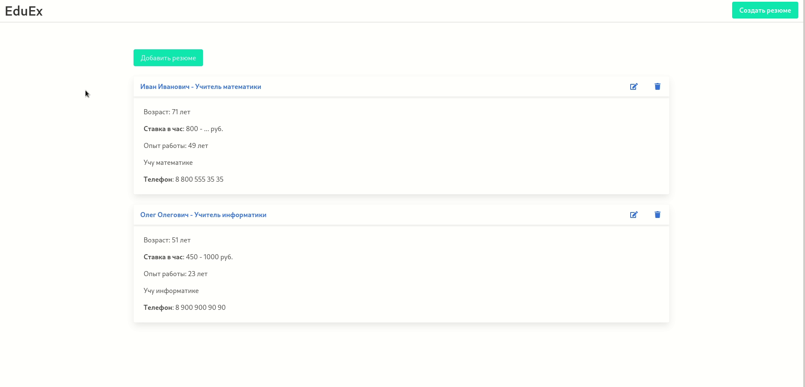

Node.JS REST API + Svelte Single Page Application
=================================================

CRUD REST API на Express.js поверх базы данных на MySQL и веб-интерфейс к нему на Svelte.

Установка
---------
```bash
git clone https://github.com/cochegarka/eduex-express-svelte.git
```

Установка и запуск сервера:
```bash
cd server
npm install
npm run start
```

Установка и запуск веб-интерфейса:
```bash
cd spa
npm install
npm run dev
```

Чтобы подключиться к какой-нибудь базе данных:
```bash
cd server
# создать .env
touch .env
# открыть каким-нибудь редактором
nano .env
# Вписать конфигурацию ниже, возможно, поменять реквизиты на свои
# DB_HOST=localhost
# DB_NAME=eduex
# DB_USER=eduex_demander
# DB_PASS=123456
```

Пример работы с приложением
---------------------------
